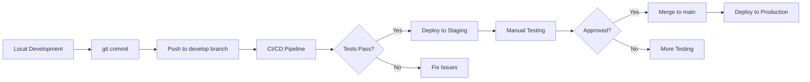

# AAA CRM - CI/CD Setup Guide

## 🚀 Continuous Integration & Deployment

This guide explains how to set up CI/CD for your Django CRM project using GitHub Actions.

## 📋 Prerequisites

- GitHub repository
- Docker and Docker Compose installed
- Basic understanding of Git

## 🔧 Setup Steps

### 1. GitHub Repository Setup

1. **Create secrets** in your GitHub repository:
   - Go to Settings → Secrets and variables → Actions
   - Add the following secrets:
     ```
     DOCKER_USERNAME=your-dockerhub-username
     DOCKER_PASSWORD=your-dockerhub-password
     PRODUCTION_HOST=your-server-ip
     PRODUCTION_USER=your-server-username
     SSH_PRIVATE_KEY=your-private-ssh-key
     DATABASE_URL=your-production-database-url
     SECRET_KEY=your-django-secret-key
     ```

### 2. Enable Branch Protection

1. Go to Settings → Branches
2. Click "Add rule" for the `main` branch
3. Enable:
   - ✅ Require status checks to pass
   - ✅ Require branches to be up to date
   - ✅ Require pull request reviews
   - ✅ Restrict pushes that create matching branches

### 3. Environment Setup

Create environments for staging and production:

1. Settings → Environments → New environment
2. Create `staging` and `production` environments
3. Add environment-specific secrets

## 🏗️ CI/CD Pipeline Features

### ✅ Automated Testing
- **Multi-Python versions**: Tests run on Python 3.9, 3.10, 3.11
- **Linting**: Flake8 and Black code quality checks
- **Unit tests**: Django test suite execution
- **Docker build**: Automated image creation

### ✅ Code Quality Gates
- **Pre-commit hooks**: Automated code formatting and linting
- **Security scanning**: Detect-secrets integration
- **Complexity checks**: Maximum complexity limits

### ✅ Automated Deployment
- **Docker deployment**: Containerized application deployment
- **Database migrations**: Automatic schema updates
- **Static file collection**: Optimized asset serving
- **Health checks**: Post-deployment verification

## 🛠️ Local Development Setup

### Using Docker Compose

```bash
# Start all services
docker-compose up -d

# Run tests
docker-compose exec app python manage.py test

# Run migrations
docker-compose exec app python manage.py migrate

# Create superuser
docker-compose exec app python manage.py createsuperuser
```

### Using Pre-commit Hooks

```bash
# Install pre-commit
pip install pre-commit
pre-commit install

# Run all hooks manually
pre-commit run --all-files
```

## 🚀 Deployment Workflow

### Development Workflow



### Production Deployment

The pipeline automatically deploys to production when:
- ✅ All tests pass
- ✅ Code quality checks pass
- ✅ Push to `main` branch
- ✅ No security vulnerabilities

## 📊 Monitoring & Rollback

### Health Monitoring

```bash
# Check application health
curl http://your-domain.com/health/

# Check Docker containers
docker-compose ps

# View logs
docker-compose logs -f app
```

### Rollback Procedure

```bash
# Quick rollback to previous version
git revert HEAD
git push origin main

# Or deploy specific commit
git checkout <commit-hash>
docker-compose up -d --build
```

## 🔒 Security Best Practices

### Environment Variables
- Never commit secrets to code
- Use GitHub Secrets for sensitive data
- Rotate secrets regularly

### Container Security
- Use non-root user in Dockerfile
- Scan images for vulnerabilities
- Keep base images updated

### Code Security
- Run security scans in CI/CD
- Use dependency vulnerability checks
- Implement rate limiting

## 🧪 Testing Strategy

### Unit Tests
```bash
# Run specific test
python manage.py test app_name.tests.TestClass.test_method

# Run all tests with coverage
coverage run manage.py test
coverage report
```

### Integration Tests
- Test API endpoints
- Test database operations
- Test user workflows

### Performance Tests
- Load testing with Locust
- Database query optimization
- Static file optimization

## 📈 Scaling Considerations

### Horizontal Scaling
```yaml
# docker-compose.scale.yml
version: '3.8'
services:
  app:
    # ... existing config
    deploy:
      replicas: 3
```

### Database Scaling
- Connection pooling
- Read replicas
- Database optimization

### Caching Strategy
- Redis for session storage
- CDN for static files
- Database query caching

## 🔧 Troubleshooting

### Common Issues

1. **Build Fails**
   ```bash
   # Check Docker build logs
   docker-compose build --no-cache

   # Verify requirements.txt
   pip install -r requirements.txt
   ```

2. **Tests Fail**
   ```bash
   # Run tests locally
   python manage.py test --verbosity=2

   # Check database setup
   python manage.py migrate
   ```

3. **Deployment Issues**
   ```bash
   # Check container logs
   docker-compose logs app

   # Restart services
   docker-compose restart
   ```

## 📚 Additional Resources

- [GitHub Actions Documentation](https://docs.github.com/en/actions)
- [Docker Best Practices](https://docs.docker.com/develop/dev-best-practices/)
- [Django Deployment Checklist](https://docs.djangoproject.com/en/3.2/howto/deployment/checklist/)
- [Security Best Practices](https://cheatsheetseries.owasp.org/cheatsheets/Docker_Security_Cheat_Sheet.html)

## 🤝 Contributing

1. Fork the repository
2. Create a feature branch
3. Make your changes
4. Add tests if applicable
5. Run the test suite
6. Submit a pull request

---

**Happy Deploying! 🚀**
